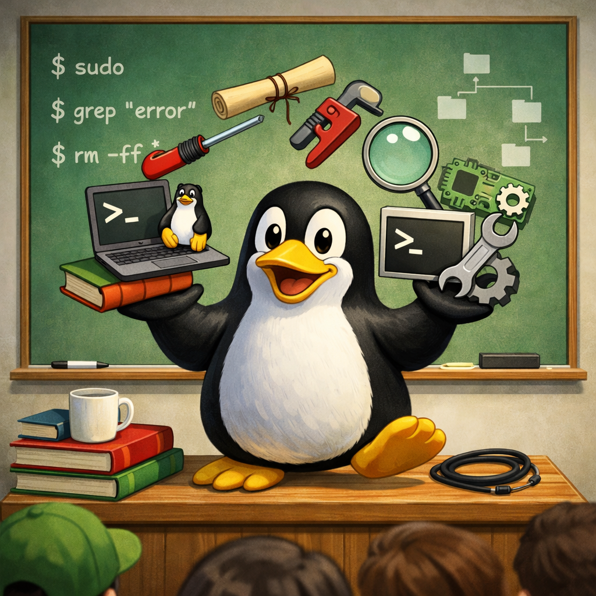
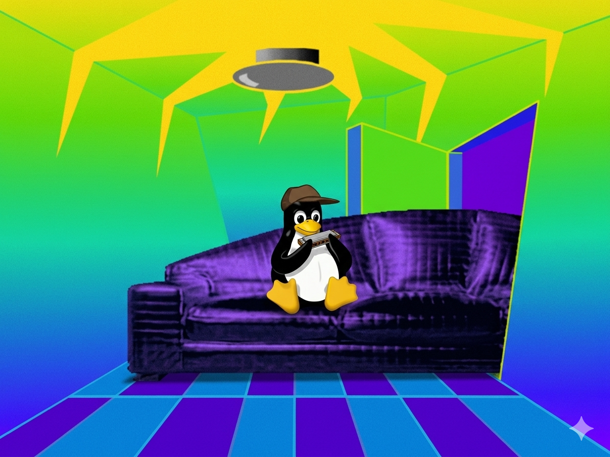
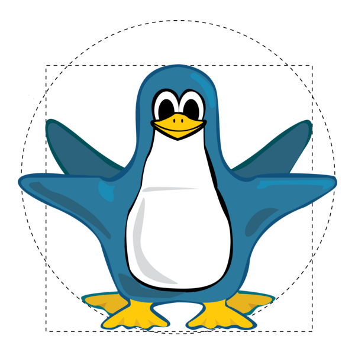
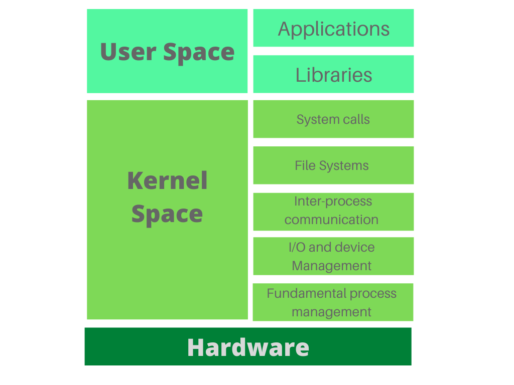
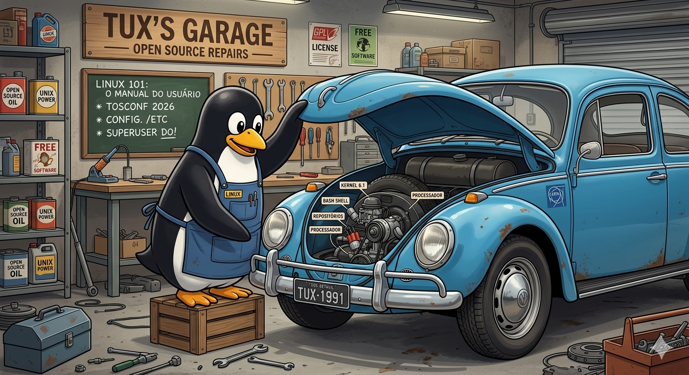

<!--
footer: Repositório desta apresentação https://github.com/andreyev/linux-101
-->

# Linux 101

## Manual do usuário

---
<!--
header: Linux 101
footer: Repositório desta apresentação https://github.com/andreyev/linux-101
-->

_Avisos_ :
* Obrigado!
* URL do repositório (quase) sempre no rodapé.
* Esta é uma introdução.
* Para fins práticos Linux == GNU/Linux etc etc
* CC-BY-4.0
* As opiniões expressas aqui são de responsabilidade exclusiva do autor e não refletem as opiniões ou posições de quaisquer entidades com as quais o autor esteja associado.

---

#  _$ whoami_

---

# _~~$ whoami~~_
* Blá blá blá
* Tic-tac ⏱️
* Tic-tac ⏱️
* Tic-tac ⏱️

---

## Agenda
* Um pouco de história
* Um pouco de teoria
* Um pouco de prática

---

## Agenda IRL
* De onde o Linux veio
* Como ele funciona
* Como "sobreviver" usando

---

# Senta que lá vem história...

---
## Computação nos anos 70-90

* Eletrônica e descentralização
* Contra-cultura
* Estética e design
* Internet
* Unix ("pai do Linux")
* Software livre (Livre != grátis)
* GNU

---

### Em 1991, um estudante finlandês escreveu em um fórum de estudantes de computação: 

> “Estou fazendo um sistema operacional (só um hobby, não será grande e profissional como o GNU...)”

---

## `$ man linux`

---

## Sistema operacional

---

## Sistema de arquivos

* Simplicadamente:
* Arquivos são "blocos de dados"
* Tudo é um arquivo
* Diretórios são arquivos que contém referências para outros
* Dispositivos (USB, placa de som etc) são arquivos para acesso aos drivers
* Existe uma especificação para a distribuição dos arquivos mas ela faz sentido:
* `/home` coisas de usuários
* `/bin` binários (**exe**cutáveis)
* `/tmp` coisas temporárias (são removidas quando o computador reinicia)

---

# `$ make`

---

## TIMTOWTDI

* there's more than one way to do it
* GUI vs CLI
* Reprodutibilidade (shell script)
* Controle
* etc

---

## 10 Comandos

* -h/--help
* history
* apropos
* man

---

## 10 Comandos

* pwd
* ls
* find
* cp/mv/rm

---

## 10 Comandos

* grep
* more/less
* sudo

---

# Dica adicional (não é um comando)

* TAB
* CTRL-c
* CTRL-l

---

## Pipe

---

## Pipe `|`

* Controle de entrada e saída entre comandos
* Um dos 3 pilares do Unix é: "faça uma única coisa bem feita"
* `gerar | filtrar | tratar`
* `find . `
* `find . | grep xxx `
* `find . | grep xxx | xargs rm`
* `find . | grep xxx | xargs rm 2> /tmp/erros`
* `find . | grep xxx | xargs rm 2> /tmp/erros > /tmp/acertos`
* `find . | grep xxx | xargs rm &> /tmp/erros_e_acertos`

---

# Processos

 

* pid & ppid
* ps
* top

---

# Obrigado!

 

---

# Referências

* https://guiafoca.org/
* https://tldp.org/
* https://unix.stackexchange.com/
* https://www.oreilly.com/search/?q=linux

---

Repositório desta apresentação https://github.com/andreyev/linux-101

---
<!--
header: Linux 101
footer: Repositório desta apresentação https://github.com/andreyev/linux-101
-->
